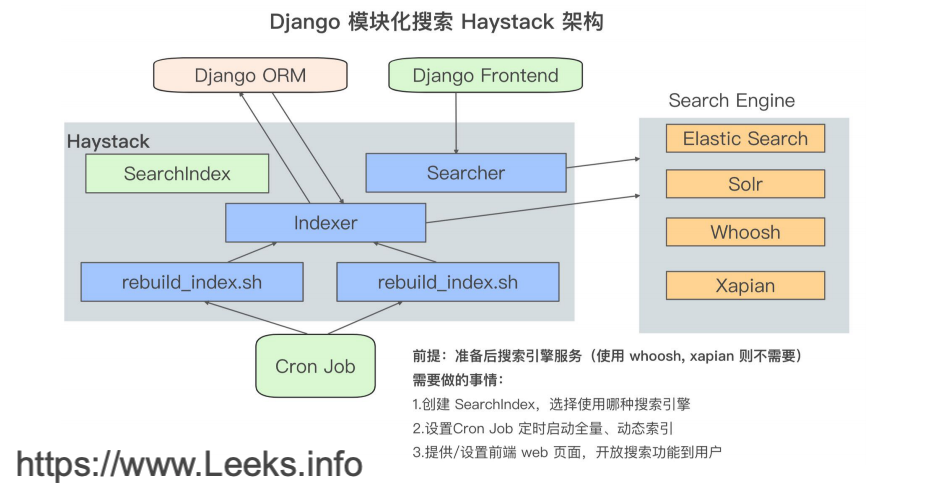

# 插件的使用

## django-grappelli

更美观的管理后台：替换Django admin的主题风格

安装 django-grappelli 风格

```shell
$ pip install django-grappelli
```

修改`settings.py`配置

```python
# Application definition

INSTALLED_APPS = [
    'grappelli',
]
```

`urls.py` 中添加 URL 映射

```python
urlpatterns = [ 
path('grappelli/', include('grappelli.urls')), 
]
```

## Bootstrap

使用 Bootstrap 来定制页面样式, 美化 HTML 页面的标签使用

* 安装依赖包

  ```shell
  $ pip install django-bootstrap4
  ```

* 添加到 apps 中：bootstrap4

  ```python
  INSTALLED_APPS = [
      'grappelli',
      'bootstrap4',
  ]
  ```

* 模板里面使用 bootstrap 标签

  ```html
  {# Load the tag library #}
  
  
  
  
  {# Load CSS and JavaScript #}
  
  
  
  {# Display django.contrib.messages as Bootstrap alerts #}
  
  
  <form method="post" method="post" class="form" enctype="multipart/form-data" style="width:600px;margin-left:5px">
      
      
  
      
      <button type="submit" class="btn btn-primary">
        Submit
      </button>
      
  </form>
  ```

## Django debug toolbar

调试 `Django Debug` 开发环境的插件，提供一个可以查看debug 信息的面板（包括SQL执行时间，页面耗时）。

可以在开发环境开启，运行时显示 Debug 信息， 包括：

- Django settings.py 中的配置；
- 请求参数；
- SQL的执行情况，耗时；
- 用到的模板、静态资源文件，信号；

[官方文档](https://django-debug-toolbar.readthedocs.io/en/latest/installation.html#prerequisites)

```shell
$ python -m pip install django-debug-toolbar
$ python -m pip install -e git+https://github.com/jazzband/django-debug-toolbar.git#egg=django-debug-toolbar
```

确保`django.contrib.staticfiles`被[正确设置](https://docs.djangoproject.com/en/stable/howto/static-files/)，并添加 `debug_toolbar`到您的`INSTALLED_APPS`设置：

```python
INSTALLED_APPS = [
    # ...
    'django.contrib.staticfiles',
    # ...
    'debug_toolbar',
]

STATIC_URL = '/static/'
```

将调试工具栏的 URL 添加到项目的 URLconf

```python
import debug_toolbar
from django.conf import settings
from django.urls import include, path

urlpatterns = [
    ...
    path('__debug__/', include(debug_toolbar.urls)),
]
```

此示例使用`__debug__`前缀，但您可以使用任何不与应用程序的 URL 冲突的前缀。请注意周围缺少引号 `debug_toolbar.urls`。

**启用中间件**

调试工具栏主要在中间件中实现。在您的设置模块中启用它，如下所示：

```python
MIDDLEWARE = [
    # ...
    'debug_toolbar.middleware.DebugToolbarMiddleware',
    # ...
]
```

**配置内部 IP**

只有在[`INTERNAL_IPS`](https://docs.djangoproject.com/en/dev/ref/settings/#std:setting-INTERNAL_IPS)设置中列出了您的 IP 地址时，才会显示调试工具栏 。这意味着对于本地开发，您*必须*添加`'127.0.0.1'`到[`INTERNAL_IPS`](https://docs.djangoproject.com/en/dev/ref/settings/#std:setting-INTERNAL_IPS); 如果您的设置模块中尚不存在此设置，则您需要创建此设置：

```python
INTERNAL_IPS = [
    # ...
    '127.0.0.1',
    # ...
]
```

您可以使用[SHOW_TOOLBAR_CALLBACK](https://django-debug-toolbar.readthedocs.io/en/latest/configuration.html#show-toolbar-callback) 选项更改确定是否应显示调试工具栏的逻辑。此选项允许您为此目的指定自定义函数。

## django-silk

性能瓶颈分析

## Simple UI

基于Element UI 和 VUE 的 Django Admin 主题

https://simpleui.72wo.com/docs/simpleui/QUICK.html

```python
# project的setting文件中增加如下配置，icon信息可以参考http://www.fontawesome.com.cn/cheatsheet/
```

https://zhuanlan.zhihu.com/p/113447102

http://www.fontawesome.com.cn/cheatsheet/

https://element.eleme.cn/#/zh-CN/component/link

## Haystack Django

模块化搜索方案



1. 安装Package: pip install django-haystack

2. 把 Haystack 添加到 settings 中

3. 配置 HAYSTACK_CONNECTIONS， 指定使用哪种搜索引擎 （Solr, ES, Whoosh, Xapian）

   ```python
   import os
   
   HAYSTACK_CONNECTIONS = {
     'default': {
       'ENGINE': 'haystack.backends.whoosh._backend.WhooshEngine',
       'PATH': os.path.join(os.path.dirname(__file__), 'whoosh_index'),
     },
   }
   ```

4. 创建 SearchIndex 来指定 model 的索引策略

   每一个 model 创建一个 SearchIndex : indexes.SearchIndex, indexes.Indexable

5. 设置搜索的 页面 View 和 URL

6. 创建索引，通常设置定时任务来创建全量索引，动态索引

## Django notifications

发送消息通知，你有 xx 条未处理简历

## Django markdown editor

Markdown 编辑器

## django-crispy-forms

Crispy 表单，以一种非常优雅、干净的方式来创建美观的表单

## django-simple-captcha

Django表单验证码

## Signals 信号及其使用场景

**什么是 Signals?**

* Django 的信号

* Django 框架内置的信号发送器，这个信号发送器在框架里面

* 有动作发生的时候，帮助解耦的应用接收到消息通知

* 当动作发生时，允许特定的信号发送者发送消息到一系列的消息接收者

* Signals 是同步调用


**信号的应用场景**

* 系统解耦；代码复用：实现统一处理逻辑的框架中间件； -> 可维护性提升

* 记录操作日志，增加/清除缓存，数据变化接入审批流程；评论通知；

* 关联业务变化通知，

* 例：通讯录变化的异步事件处理，比如员工入职时发送消息通知团队新人入职，员工离职时异步清理员工的权限等等；


**Signals 类的子类 （Django内置的常用信号）**

* django.db.models.signals.pre_init 模型实例初始化前

* django.db.models.signals.post_init 模型实例初始化后

* django.db.models.signals.pre_save 模型保存前

* django.db.models.signals.post_save 模型保存后

* django.db.models.signals.pre_delete 模型删除前

* django.db.models.signals.post_delete 模型删除后

* django.db.models.signals.m2m_changed 多对多字段被修改

* django.core.signals.request_started 接收到 HTTP 请求

* django.core.signals.request_finished HTTP 请求处理完毕


**Signals信号及其使用场景**

如何注册信号处理器/接收器

调用 Signals 任意一个子类的 connect方法

```tex
Signal.connect(receiver, sender=None, weak=True, dispatch_uid=None)

receiver: 信号接收器，一个回调函数，即处理信号的函数。
sender: 信号的发送源，哪个发送方发出的信号。
weak: 是否弱引用，默认是弱引用，当 receiver 为局部变量时，接收器可能被回收。
dispatch_uid: 信号接收器的唯一标识符，用来避免接收器被重复注册。
```


除了使用 Signal.connect() 方法注册处理器外，也可以使用 @receiver 的装饰器来注册


示例：使用装饰器来注册，修改数据时，发送消息通知到钉钉

在apps 的 ready() 函数中加载信号处理器

settings 中使用完整的名称注册 AppConfig，去掉原先注册的 jobs 应用。

```python
INSTALLED_APPS = [
    # 'simpleui',
    'bootstrap4',
    ...
    # 'jobs',  # 应用不能重复注册，后面手工注册 JobConfig，去掉了这一行的注册
    'jobs.apps.JobConfig',
]
```


示例： 使用 @receiver 装饰器来注册信号处理器: 删除投递的简历时发送通知

1. 定义信号： 在项目根目录新建文件 self_signal.py

   ```python
   import django.dispatch
   my_signal = django.dispatch.Signals(providing_args=["argument1","argument2"])
   ```

2. 触发信号：业务逻辑中触发信息

   ```python
   from self_signal import my_signal
   my_signal.send(sender="Recruitment", argument1=111, argument2=2)
   ```

3. 注册信号处理器/接收器

   ```python
   from self_signal import my_signal
   my_signal.connect(callback_of_my_signal)
   ```


`signal_processor.py`

```python
import json
import logging

from django.db.models.signals import post_save, post_delete
from django.dispatch import receiver

from interview.dingtalk import send
from .models import Job, Resume

logger = logging.getLogger(__name__)


# 使用 decorator 来注册 信号处理器
@receiver(signal=post_save, sender=Resume, dispatch_uid="resume_post_save_dispatcher")
@receiver(signal=post_save, sender=Job, dispatch_uid="job_post_save_dispatcher")
def post_save_callback(sender, instance=None, created=False, **kwarg):
    message = ""
    if isinstance(instance, Job):
        message = "Job for %s has been saved" % instance.job_name
    else:
        message = "Resume for %s %s has been saved " % (instance.username , instance.apply_position)
    
    logger.info(message)
    send(message)


from django.forms.models import model_to_dict

def post_delete_callback(sender, instance=None, using=None, **kwarg):
    dict_obj = model_to_dict( instance, exclude=("picture","attachment", "created_date", "modified_date") )
    message = "Instance of %s has been deleted: %s" % (type(instance), json.dumps(dict_obj, ensure_ascii=False))
    logger.info(message)
    send(message)

# 手工注册信号处理器
post_delete.connect(post_delete_callback, sender=Resume, dispatch_uid="resume_post_delete_dispatcher")

```

`apps.py`

```python
from django.apps import AppConfig
import logging
logger = logging.getLogger(__name__)

class JobConfig(AppConfig):
    name = 'jobs'

    def ready(self):
        logger.info("JobConfig ready")
        from jobs.signal_processor import post_save_callback

```
